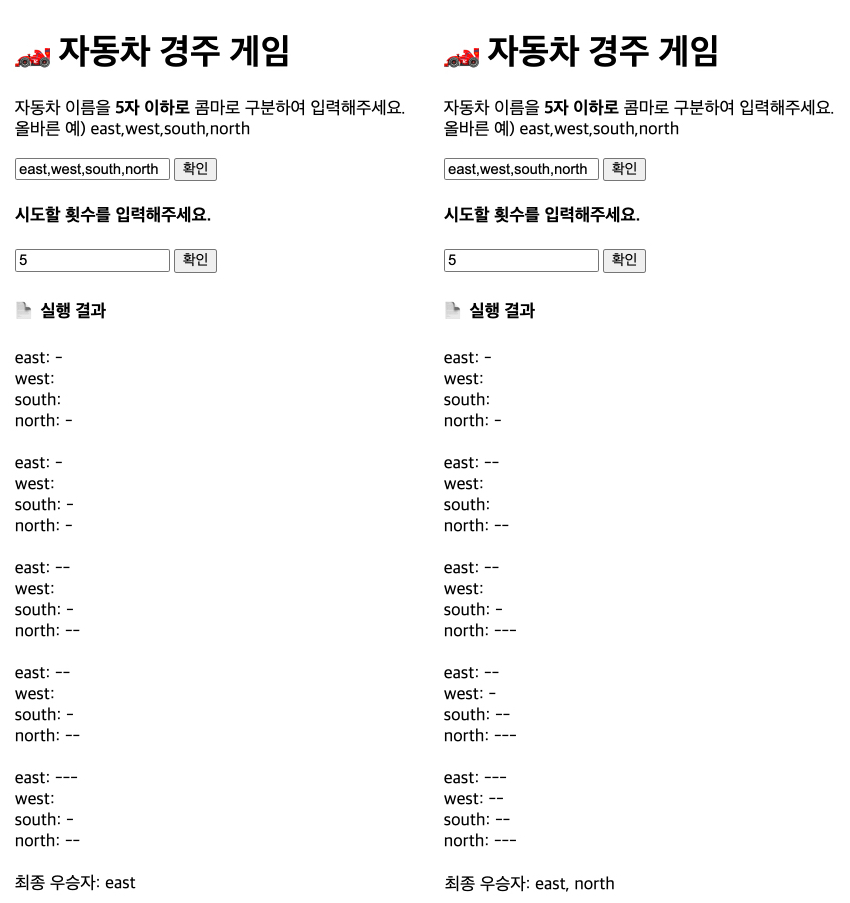

<p align="middle" >
  
</p>
<h2 align="middle">자동차 경주 게임</h2>
<h3 align="middle">HTML / CSS / JavaScript 활용 연습 Part05</h3>
<p align="middle">DEMO : </p>
<p align="middle">
  
  
  
  
  
</p>

## 🔍 진행방식

- 기능을 구현하기 전에 기능 목록을 만들고, 기능 단위로 커밋 하는 방식으로 진행한다.

---

## 🎯 기능 요구사항

초간단 자동차 경주 게임을 구현한다.

- [x] 주어진 횟수 동안 n 대의 자동차는 전진 또는 멈출 수 있다.
- [x] 자동차에 이름을 부여할 수 있다. 전진하는 자동차를 출력할 때 자동차 이름을 같이 출력한다.
- [ ] 자동차 이름은 쉼표(,)를 기준으로 구분하며 이름은 5자 이하만 가능하다.
- [x] 사용자는 몇 번의 이동을 할 것인지를 입력할 수 있어야 한다.
- [x] 전진하는 조건은 0에서 9 사이에서 무작위 값을 구한 후 무작위 값이 4 이상일 경우이다.
- [x] 자동차 경주 게임을 완료한 후 누가 우승했는지를 알려준다. 우승자는 한 명 이상일 수 있다.
- [x] 우승자가 여러 명일 경우 쉼표(,)를 이용하여 구분한다.
- [ ] 사용자가 잘못된 입력 값을 작성한 경우 `alert`을 이용해 메시지를 보여주고, 다시 입력할 수 있게 한다.

## 💟 기능 구현 목록

### ▶️ 기본 기능

- [x] 자동차 이름을 입력 받는다.
- [x] 몇 번의 이동을 할 것인지(이동 횟수) 입력 받는다.
- [x] `Math.random()`함수를 활용해서 전진할지 말지를 결정한다.

### ▶️ 출력 기능

- [x] 이동 횟수마다 자동차별로 이동 거리를 표시한다.
- [ ] 자동차 이름은 아스키코드 순서로 정렬하여 출력한다.
- [x] 이동 거리를 종합해서 최종 우승자를 표시한다. (한명이 아닐 수 있다.)

### ▶️ 입력 유효성 검사

- [ ] 자동차 이름은 5자 이하만 가능하다.
- [ ] 자동차 이름은 쉼표(,)로 구분된다.
- [ ] 자동차 이름은 최대 10개까지만 입력 받는다.
- [ ] 이동 횟수는 숫자만 입력 받는다.
- [ ] 이동 횟수는 최대 20까지만 입력 받는다.
- [ ] 잘못된 입력 값을 작성한 경우 `alert`를 이용해 메시지를 보여준다.

### ▶️ 추가 기능

- [ ] (매번 입력하기 귀찮으니) 자동 입력 버튼
- [ ] 이동 횟수도 자동으로 입력해주는 버튼
- [ ] 입력을 지워주는 `reset` 버튼

<br>

### 💻 실행 결과



<br>

---

## ✅ 프로그래밍 요구사항

- 주어진 `index.html`에 html 엘리먼트를 직접 추가하거나 기존의 html 엘리먼트를 임의로 삭제하지 않는다. id와 같은 선택자를 추가하는 작업만 가능하다.
- 다음과 같이 Car 객체를 만들고, new 를 이용해 인스턴스를 만들어 사용한다.

```javascript
function Car(name) {
  this.name = name;
}

class Car {
  constructor(name) {
    this.name = name;
  }
}
```

## 💭 기본 요구사항

- 외부 라이브러리(jQuery, Lodash 등)를 사용하지 않고, 순수 Vanilla JS로만 구현한다.
- **[자바스크립트 코드 컨벤션](https://github.com/woowacourse/woowacourse-docs/tree/feature/styleguide/styleguide/javascript)을 지키면서 프로그래밍** 한다.
- **indent(인덴트, 들여쓰기) depth를 3이 넘지 않도록 구현한다. 2까지만 허용**한다.
  - 예를 들어 while문 안에 if문이 있으면 들여쓰기는 2이다.
  - 힌트: indent(인덴트, 들여쓰기) depth를 줄이는 좋은 방법은 함수(또는 메소드)를 분리하면 된다.
- **함수(또는 메소드)가 한 가지 일만 하도록 최대한 작게** 만들어라.
- 변수 선언시 `var` 를 사용하지 않는다. `const` 와 `let` 을 사용한다.
  - [const](https://developer.mozilla.org/ko/docs/Web/JavaScript/Reference/Statements/const)
  - [let](https://developer.mozilla.org/ko/docs/Web/JavaScript/Reference/Statements/let)
- `import` 문을 이용해 스크립트를 모듈화하고 불러올 수 있게 만든다.
  - [https://developer.mozilla.org/ko/docs/Web/JavaScript/Reference/Statements/import](https://developer.mozilla.org/ko/docs/Web/JavaScript/Reference/Statements/import)
- **함수(또는 메소드)의 길이가 15라인을 넘어가지 않도록 구현한다.**
  - 함수(또는 메소드)가 한 가지 일만 잘 하도록 구현한다.

<br>

## ✔️ 테스트 실행 가이드

- 테스트 실행에 필요한 패키지 설치를 위해 `Node.js` 버전 `14` 이상이 필요하다.
- 다음 명령어를 입력해 패키지를 설치한다.

```bash
// {폴더 경로}/javascript-racingcar-precourse/ 에서
npm install
```

- 설치가 완료되었다면, 다음 명령어를 입력해 테스트를 실행한다.

```bash
// {폴더 경로}/javascript-racingcar-precourse/ 에서
npm run test
```

- 아래와 같은 화면이 나오며 모든 테스트가 pass한다면 성공!


